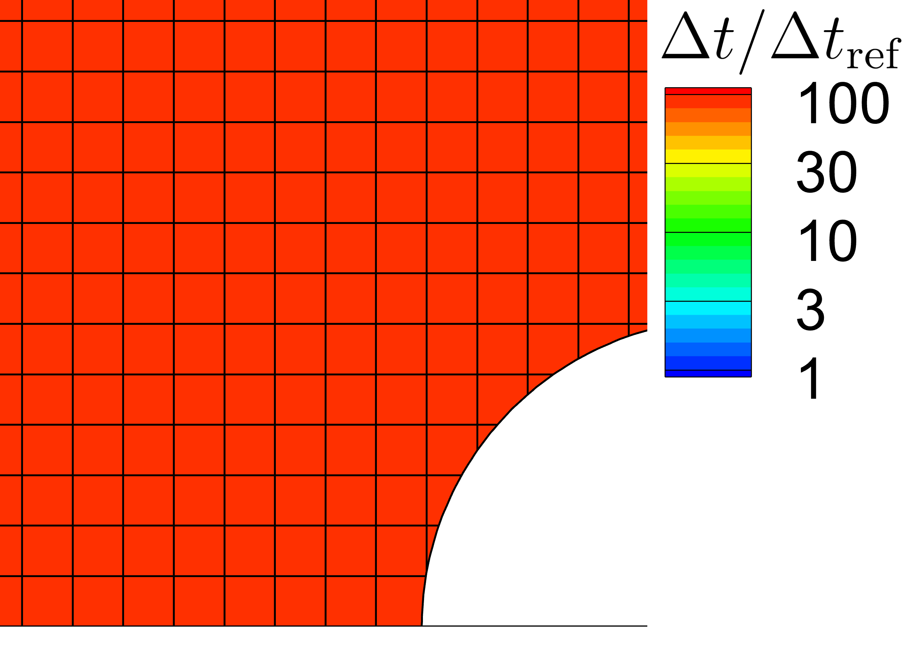

**SPARTACUS** is a Unified Stochastic Particle (*USP*) solver based on SPARTA.
**SPARTACUS** stands for **SPARTA** **C**ombined with **US**P.
The *USP* method is proposed by *Fei et al.* to simulate multi-scale gas flows.

> [examples_USP](./examples_USP/) contains Several benchmark cases and tutorial examples.

> [doc/collide.html](./doc/collide.html) & [doc/collide_bgk_modify.html](./doc/collide_bgk_modify.html)  contains essential documentation about this solver.

Downloading, installing and using SPARTACUS is exactly the same as SPARTA, which is fully described within [SPARTA Users Manual](https://sparta.github.io/doc/Manual.html), unless specified in the above files and directories

*Coupled time step and grid adaptation based on local characteristic scale is available now!*

**SPARTACUS Papers**

The following papar introduces the implementation of the USP method in the current version of SPARTACUS.

> Feng, K., Tian, P., [**Zhang, J.***][junzhangmail], Fei, F., Wen, D., 2022. [**SPARTACUS: An open-source unified stochastic particle solver for the simulation of multiscale nonequilibrium gas flows.**](https://doi.org/10.1016/j.cpc.2022.108607) Computer Physics Communications 108607. 

> Feng, K., Cui, Z., Tian, P., [**Zhang, J.***][junzhangmail] [**A Unified Stochastic Particle Method with Spatiotemporal Adaptation for Simulating Multiscale Gas Flows.**](http://dx.doi.org/10.2139/ssrn.4596538) Available at SSRN 4596538.

The following paper covers the theoretical foundation of SPARTACUS, namely the development of USP method.

> Fei, F., [**Zhang, J.***][junzhangmail], Li, J., [**Liu, Z.***](mailto:zliu@hust.edu.cn), 2020. [**A unified stochastic particle Bhatnagar-Gross-Krook method for multiscale gas flows.**](https://doi.org/10.1016/j.jcp.2019.108972) Journal of Computational Physics 400, 108972. 

> [**Fei, F.***][feifeimail], Ma, Y., [**Wu, J.***](mailto:jiewu@hust.edu.cn), Zhang, J., 2021. [**An efficient algorithm of the unified stochastic particle Bhatnagar-Gross-Krook method for the simulation of multi-scale gas flows.**](https://doi.org/10.1186/s42774-021-00069-8) Adv. Aerodyn. 3, 18. 

> [**Fei, F.***][feifeimail], [**Hu, Y.***](mailto:yhu@imech.ac.cn), Jenny, P., 2022. [**A unified stochastic particle method based on the Bhatnagar-Gross-Krook model for polyatomic gases and its combination with DSMC.**](https://doi.org/10.1016/j.jcp.2022.111640) Journal of Computational Physics 471, 111640. 

The following are some partial papers that discuss the application of SPARTACUS or the USP method

> Tian, P., Feng, K., Ma, Q., Li, Z., [**Zhang, J.***][junzhangmail], 2023.[ **Unified stochastic particle simulation of polyatomic gas flows using SPARTACUS**](https://doi.org/10.1016/j.compfluid.2023.105987). Computers & Fluids 265, 105987. 

> [**Zhang, J.***][junzhangmail], Yao, S., [**Fei, F.***][feifeimail], Ghalambaz, M., Wen, D., 2020. [**Competition of natural convection and thermal creep in a square enclosure.**](https://doi.org/10.1063/5.0022260) Physics of Fluids 32, 102001. 

> Ma, Q., Yang, C., Chen, S., Feng, K., Cui, Z., [**Zhang, J.***][junzhangmail] (2023).[**Effect of thermal fluctuations on spectra and predictability in compressible decaying isotropic turbulence.**](
https://doi.org/10.48550/arXiv.2306.17589) arXiv preprint arXiv:2306.17589.

[junzhangmail]: mailto:jun.zhang@buaa.edu.cn 'junzhangmail'
[feifeimail]: mailto:ffei@hust.edu.cn 'feifeimail'

----------------------------------------------------------------------
----------------------------------------------------------------------

SPARTA on GitHub: https://github.com/sparta/sparta 

***Original SPARTA README:***

This is the SPARTA software package.

SPARTA stands for Stochastic PArallel Rarefied-gas Time-accurate
Analyzer.

Copyright (2014) Sandia Corporation.  Under the terms of Contract
DE-AC04-94AL85000 with Sandia Corporation, the U.S. Government retains
certain rights in this software.  This software is distributed under
the GNU General Public License.

----------------------------------------------------------------------

SPARTA is a Direct Simulation Monte Carlo (DSMC) code designed to run
efficiently on parallel computers.  It was developed at Sandia
National Laboratories, a US Department of Energy facility, with
funding from the DOE.  It is an open-source code, distributed freely
under the terms of the GNU Public License (GPL).

The primary authors of the code are Steve Plimpton and Michael Gallis,
who can be emailed at sjplimp@sandia.gov and magalli@sandia.gov.  The
SPARTA web site at http://sparta.sandia.gov has more information about
the code and its uses.

The SPARTA distribution includes the following files and directories:

README			   this file
LICENSE			   the GNU General Public License (GPL)
bench                      benchmark problems
data                       files with species/reaction params, surface files
doc                        documentation
examples                   simple test problems
lib                        additional library files
python                     Python wrapper on SPARTA as a library
src                        source files
tools                      pre- and post-processing tools

Point your browser at any of these files to get started:

doc/Manual.html	           the SPARTA manual
doc/Section_intro.html	   hi-level introduction to SPARTA
doc/Section_start.html	   how to build and use SPARTA
doc/Developer.pdf          SPARTA developer guide
